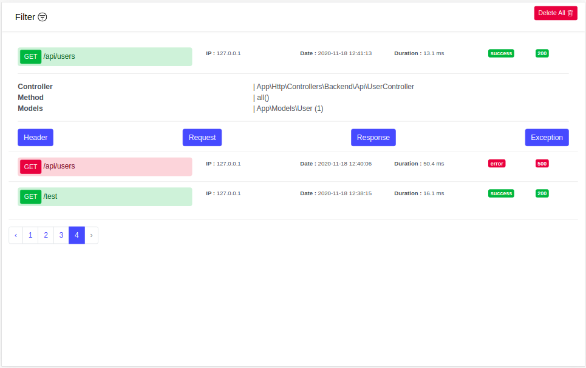

# Dogger
### Log api request & response by using Database
This package may help you to log api request,response,duration,method,ip,http status and retireved classes (controller,model,etc...) in database. 
### Installation
1. Install the package via composer
```
composer require cracki/dogger
```
2. Publish the config file 
```
php artisan vendor:publish --tag=config --provider="Cracki\Dogger\DoggerServiceProvider"
```
3. Migrate Table
```
php artisan migrate
```
### Usage
```php
//in api.php or web.php
Route::group([
    'middleware'=> 'dogger'
], function () {
    ...
    //Your routes is here.
    ...
});
```
### Custom Error
```php
//response json as follow
{
    'result' : 'error', // (or 'success' accepted only 2 enum)
    ...
}
```
### Logs View

### Routes List
|route    |method   |description
|:----|:----|:----|
|/dogger| get     |view logs
|/dogger/delete|post  |clear logs
|/dogger/api/get-all| get    |get logs with json
|/dogger/api/delete-all| post     |delete all

## License
Licensed under [The MIT License (MIT)](LICENSE).
